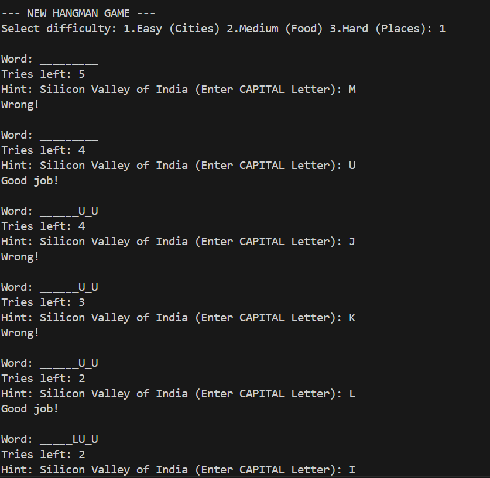
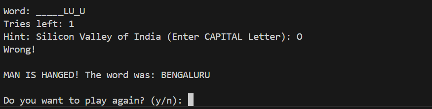

# MODIFIED_HANGMAN
In the realm of computer programming, developing logic-building games is a fundamental way to enhance problem-solving skills and algorithmic thinking. Hangman is a classic word-guessing game that challenges players to identify hidden words within a limited number of attempts. This project focuses on the design and implementation of an advanced text-based Hangman Game using the C programming language.

Unlike simple implementations, this version includes dynamic word selection and replayability. The system utilizes random number generation to select a word from predefined categories: Easy (Cities), Medium (Food), and Hard (Places). Each word is paired with a specific unique hint to aid the user. The program captures character input in real-time, tracks "lives" (attempts), and updates the visual status. Additionally, the game features a loop that allows users to play multiple rounds without restarting the program.

This project demonstrates the effective use of C libraries such as <string.h> for text processing, <stdlib.h> and <time.h> for randomization, and control structures like do-while loops for game flow management.

Results:

